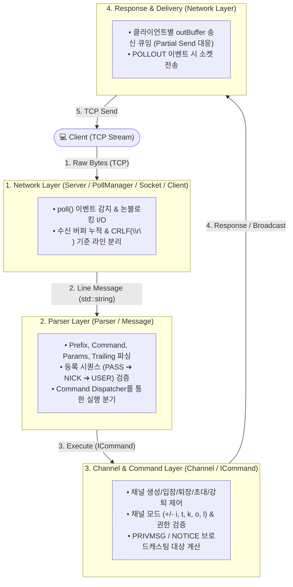

# ft_irc

## Description

1988년 8월 핀란드 오울루 대학교의 **Jarkko Oikarinen**이 개발한 **IRC(Internet Relay Chat)** 는 인터넷 역사상 가장 초기이자 막대한 영향을 끼친 실시간 텍스트 통신 프로토콜 중 하나로, Slack 및 Discord와 같은 현대 협업/메신저 플랫폼의 기초를 확립했습니다.

**Project Goal**: **ft_irc**는 **RFC 1459** 표준 규격을 준수하여 **C++98** 로 직접 개발한 IRC 서버입니다. 단일 스레드에서 poll() 기반 I/O 멀티플렉싱을 통해 다중 클라이언트의 동시 접속을 처리하고, 채널 관리와 실시간 메시지 브로드캐스팅을 안전하게 지원하는 논블로킹 네트워크 서버 구현을 핵심 목표로 합니다.

---

## 📌 Requirements

- **언어**: C++98
- **컴파일러 & 플래그**: `c++` (`-Wall -Wextra -Werror -std=c++98`)
- **I/O Multiplexing**: `poll()` 기반 논블로킹 소켓 I/O
- **외부 라이브러리**: 표준 C++98 라이브러리만 사용 (Boost 등 외부 라이브러리 미사용)
- **테스트 환경**: Python 3.x (통합 테스트 시)

---

## 🚀 Quick Start

### 1. Build
```bash
make            # ircserv 실행 파일 빌드
make clean      # 오브젝트 및 의존성 파일 삭제
make fclean     # 생성된 바이너리 포함 전체 삭제
make re         # 클린 재빌드
```

### 2. Run
```bash
./ircserv <port> <password>

# 예시: 6667 포트, 비밀번호 '1234'로 서버 시작
./ircserv 6667 1234
```

### 3. Connect & Test
- **nc (Netcat) 사용**:
  ```bash
  nc 127.0.0.1 6667
  PASS 1234
  NICK mynick
  USER mynick 0 * :My Name
  ```
- **표준 IRC 클라이언트 (Irssi)**:
  ```bash
  irssi -c 127.0.0.1 -p 6667 -w 1234 -n mynick
  ```
  또는
  ```bash
  irssi # 실행 후 아래 명령어 입력
  /connect 127.0.0.1 6667 -password 1234
  /nick mynick
  ```

---

## 🤝 Collaboration & Conventions

팀의 일관된 협업 흐름과 코드 품질 유지를 위해 상세 가이드를 마련했습니다.  
작업 시작 전 아래 문서를 반드시 확인해 주세요!

 **[상세 GitHub 협업 가이드 (docs/COLLABORATION_GUIDE.md)](docs/COLLABORATION_GUIDE.md)**  
*(브랜치 전략, 커밋 룰, PR 템플릿, 코드 리뷰 가이드, 충돌 해결법 포함)*

### 핵심 룰 요약 (Quick Rules)
-  **직접 Push 금지**: `main`, `dev` 브랜치 직접 push 절대 금지
-  **브랜치 흐름**: `dev` 최신화 ➔ `feature/<담당>-<기능>` / `fix/<담당>-<버그>` 생성 ➔ PR 생성 ➔ 리뷰 승인 후 `dev` 머지
-  **PR 및 코드 리뷰**: 최소 1인 이상 Approve 필수 (`Squash and merge` 원칙)
-  **커밋 컨벤션**: `<type>(<담당>): <설명>` (예: `feat(parser): PRIVMSG 파싱 구현`, `fix(network): poll 이벤트 누락 수정`)
-  **공통 영역**: `include/common/` 및 `src/common/` 수정 시 팀원 3인 전원 합의 필수

---

## 🧱 Architecture & Data Flow

`ft_irc`는 책임 분리를 위해 계층형(Layered) 아키텍처로 설계되었습니다.



---

## 📂 Directory Structure

`include/`와 `src/`는 모듈별로 완벽하게 미러링된 구조를 갖습니다.

```text
.
├── Makefile
├── README.md
├── docs/
│   ├── COLLABORATION_GUIDE.md   ← GitHub 협업 가이드
│   ├── PLAN.md                  ← 3주 개발 일정 및 마일스톤
│   └── todo.md                  ← 작업 체크리스트
├── include/
│   ├── client/
│   │   └── Client.hpp           ← 클라이언트 상태 및 버퍼 관리
│   ├── server/
│   │   ├── Server.hpp           ← 서버 메인 컨트롤러
│   │   ├── PollManager.hpp      ← pollfd 관리 및 이벤트 폴링
│   │   └── Socket.hpp           ← 소켓 생성/바인딩/리스닝 래퍼
│   ├── parser/
│   │   ├── Parser.hpp           ← 메시지 파서 및 디스패처
│   │   ├── Message.hpp          ← 파싱된 IRC 메시지 구조체
│   │   └── commands/            ← Pass, Nick, User, Ping, Pong, Quit
│   ├── channel/
│   │   ├── Channel.hpp          ← 채널 상태/모드/멤버 관리
│   │   └── commands/            ← Join, Part, Topic, Mode, Kick, Invite, Privmsg
│   └── common/
│       ├── ICommand.hpp         ← 커맨드 인터페이스
│       ├── Replies.hpp          ← RFC 규격 응답 코드 상수
│       └── Utils.hpp            ← 유틸리티 함수
├── src/
│   ├── main.cpp
│   ├── client/
│   │   └── Client.cpp
│   ├── server/
│   │   ├── Server.cpp
│   │   ├── ServerAuth.cpp
│   │   ├── Servercmds.cpp
│   │   ├── PollManager.cpp
│   │   └── Socket.cpp
│   ├── parser/
│   │   ├── Parser.cpp
│   │   ├── Message.cpp
│   │   └── commands/
│   ├── channel/
│   │   ├── Channel.cpp
│   │   └── commands/
│   └── common/
│       └── Utils.cpp
└── tests/
    ├── parser/
    ├── test_integration.py      ← RFC 1459 규격 통합 테스트
    └── test_integration_irssi.py← Irssi 클라이언트 통합 테스트
```

---


## 👥 Team & Roles

| 팀원 | 담당 영역 | 핵심 역할 |
| :--- | :--- | :--- |
| **mAyoOopark** | **네트워크 계층** | 논블로킹 TCP 소켓 생명주기 관리, `poll()` I/O 멀티플렉싱, 연결 관리 및 송수신 버퍼 스트림 처리 |
| **erdoslibrary** | **파서 계층** | RFC 1459 메시지 파싱, 명령어 디스패칭, 등록 시퀀스(`PASS`, `NICK`, `USER`) 검증 및 세션 제어(`QUIT`, `PING`, `PONG`) |
| **mj-jo** | **채널 계층** | 채널 생명주기 및 멤버십 관리, 채널 모드(`+i`, `+t`, `+k`, `+o`, `+l`), 채널 명령어(`JOIN`, `PART`, `INVITE`, `KICK`, `TOPIC`, `PRIVMSG`) 구현 |

---

## Features

### 1. Supported Commands

| 카테고리 | 명령어 | 설명 |
|---|---|---|
| **연결 및 인증** | `PASS` | 서버 비밀번호를 통한 연결 인증 |
| | `NICK` | 클라이언트 닉네임 설정 및 변경 (고유성 검증) |
| | `USER` | 사용자명 및 실명 등록으로 최종 등록 완료 |
| | `PING` / `PONG` | 연결 생존 확인을 위한 하트비트 메커니즘 |
| | `QUIT` | 정상 연결 종료 및 공유 채널에 퇴장 메시지 브로드캐스트 |
| **채널 작업** | `JOIN` | 채널 생성 또는 입장 (비밀번호, 인원제한, 초대 상태 검증) |
| | `PART` | 지정한 채널에서 퇴장 |
| | `TOPIC` | 채널 주제(Topic) 조회 및 변경 |
| | `MODE` | 채널 모드 및 오퍼레이터(운영자) 권한 설정/조회 |
| | `KICK` | 채널에서 특정 사용자 강제 퇴장 (오퍼레이터 전용) |
| | `INVITE` | 초대 전용 채널에 사용자 초대 (오퍼레이터 전용) |
| **메시징** | `PRIVMSG` | 특정 사용자 1:1 메시지 전송 또는 채널 전체 브로드캐스트 |

### 2. Supported Channel Modes

- `+i` / `-i`: 초대 전용(Invite-only) 채널 설정 / 해제
- `+t` / `-t`: 채널 운영자(Operator)만 `TOPIC`을 변경할 수 있도록 제한 / 해제
- `+k` / `-k`: 채널 비밀번호(Key) 설정 / 해제
- `+o` / `-o`: 채널 운영자(Operator) 권한 부여 / 박탈
- `+l` / `-l`: 채널 최대 접속 인원수(Limit) 제한 / 해제
---

## 🧪 Testing

```bash
# 1. 단위 테스트 + RFC 1459 규격 통합 테스트
make test

# 2. Irssi 클라이언트 호환성 통합 테스트
make test_irssi
```

---

## 📚 References

- [RFC 1459 - Internet Relay Chat Protocol](https://datatracker.ietf.org/doc/html/rfc1459)
- [RFC 2812 - Internet Relay Chat: Client Protocol](https://datatracker.ietf.org/doc/html/rfc2812)
- UNIX Network Programming, Volume 1 (W. Richard Stevens)